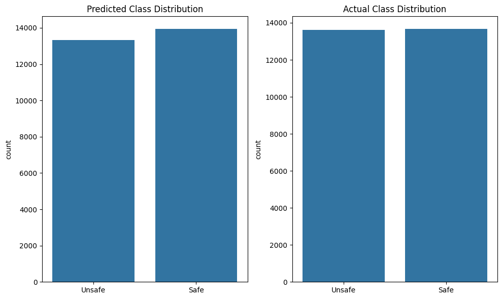
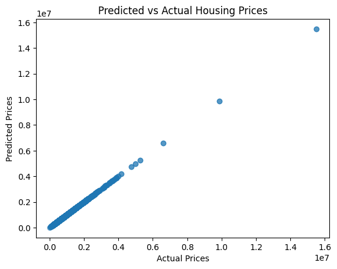

# MA Housing Analysis

## Table of Contents
- [Overview](#overview)
- [Motivation](#motivation)
- [Project-Goal](#project-goal)
- [Usage](#usage)
- [Results](#results)
- [Future Work](#future-work)

---

## Overview
This project analyzes housing and crime data across Massachusetts to understand pricing trends, regional differences, and factors influencing housing costs such as crime rates and different types of crimes. 

Using Python, Pandas, NumPy, and visualization libraries, the project explores both raw and cleaned datasets to uncover meaningful insights about the MA housing market.

The repository includes:
- `Data/` — Raw and cleaned housing datasets  
- `Code/` — Jupyter notebook code
- `Pictures/` — Saved charts and plot outputs  
- `Report/` — Report highlighting findings  

---

## Motivation
Massachusetts continues to have one of the most expensive and competitive housing markets in the United States. Understanding the data behind these trends helps answer important questions such as:

- How does the crime rate in a city relate to its median house price?
- Over the past 5–10 years, has the rise or fall in crime rates affected housing prices?
- Can we classify whether a city is “Safe” or “Unsafe” based on housing and economic indicators?
- Can we forecast how changes in crime rates might affect future housing prices?

This project uses real live housing and crime data to bring clarity to these issues and support data-driven decision making.

---

## Project Goal
The primary goals of this project are:

1. Clean and preprocess MA housing datasets for consistent and accurate analysis.  
2. Perform Exploratory Data Analysis (EDA) to uncover trends, distributions, and anomalies.  
3. Generate visualizations and correlations that make price changes and regional differences easy to interpret.
4. Summarize findings in a clear, readable format to help understand the dynamics of MA housing.

---

## Results

### 1. How does the crime rate in a city relate to its median house price?
According to the correlation that was exctracted, crime rates do not have any significant effect on the median house price. 

### Correlation Matrix

| Variable            | All Offense Types | MEDIAN_LIST_PRICE |
|---------------------|------------------:|------------------:|
| **All Offense Types** | 1.000000          | -0.056606          |
| **MEDIAN_LIST_PRICE** | -0.056606         | 1.000000           |


### 2. Over the past 5–10 years, has the rise or fall in crime rates affected housing prices?

From 2015 to 2020, the correlation between crime rates and median house prices is **-0.129601**.  
This indicates a **weak negative relationship**, meaning areas with higher offense counts tended to have *slightly* lower home prices—although the effect is still minor and not meaningful statistically.

#### Correlation Matrix (2015–2020)
| Variable              | All Offense Types | MEDIAN_LIST_PRICE |
|-----------------------|------------------:|------------------:|
| **All Offense Types** | 1.000000          | -0.129601         |
| **MEDIAN_LIST_PRICE** | -0.129601         | 1.000000          |


For the years 2020 to 2024, the correlation is **-0.030287**, which is even closer to zero. This means that during this period, **crime rates had almost no relationship** with median house prices. 
#### Correlation Matrix (2020–2024)
| Variable              | All Offense Types | MEDIAN_LIST_PRICE |
|-----------------------|------------------:|------------------:|
| **All Offense Types** | 1.000000          | -0.030287         |
| **MEDIAN_LIST_PRICE** | -0.030287         | 1.000000          |


### 3. Can we classify whether a city is “Safe” or “Unsafe” based on housing and economic indicators?

The short answer is yes. We can definitely classify cities with safe or unsafe lables and below are the results of the classification.

**Classification Model Performance**

**Accuracy:** `0.9572884587182872`

#### Classification Report
| Metric      | Class 0 | Class 1 |
|-------------|---------|---------|
| Precision   | 0.95    | 0.97    |
| Recall      | 0.97    | 0.95    |
| F1-Score    | 0.96    | 0.96    |
| Support     | 13663   | 13613   |

**Overall Accuracy:** 0.96  
**Macro Avg F1:** 0.96  
**Weighted Avg F1:** 0.96  

#### Confusion Matrix

| Actual \\ Predicted | Predicted 0 | Predicted 1 |
|---------------------|-------------|-------------|
| **Actual 0**        | 13217 (TN)  | 446 (FP)    |
| **Actual 1**        | 719 (FN)    | 12894 (TP)  |


- **TP (True Positive):** Correctly predicted positive cases  
- **TN (True Negative):** Correctly predicted negative cases  
- **FP (False Positive):** Incorrectly predicted positive  
- **FN (False Negative):** Missed positive cases  




### 4. Can we forecast how changes in crime rates might affect future housing prices?

**Coefficients of our features**
| Feature                  | Coefficient        |
|--------------------------|--------------------|
| price_lag_1              | 5.000000e-01       |
| price_lag_3              | 5.000000e-01       |
| All Offense Types        | 9.403889e-14       |
| crime_lag_1              | 9.403889e-14       |
| crime_lag_3              | 9.403889e-14       |
| Crimes Against Person    | -4.046004e-13      |
| Crimes Against Property  | -2.261479e-13      |




---

## Future Work
**Investment Recommendation System**

A future extension of this project could include building a machine learning based recommendation system that answers the question, “Which city should a buyer invest in next year?” 

**City Clustering with K-Means**

Another promising direction is to use K-Means clustering to group Massachusetts cities based on shared characteristics such as crime levels, median house price, and growth patterns. Clustering would reveal meaningful city profiles for example, “high-crime, low-cost” areas with redevelopment potential or “rapid-growth, high-value” clusters representing strong investment markets.


### Usage - Clone the repository
```bash
git clone https://github.com/davprog9/MA-Housing-Analysis.git
cd MA-Housing-Analysis
```